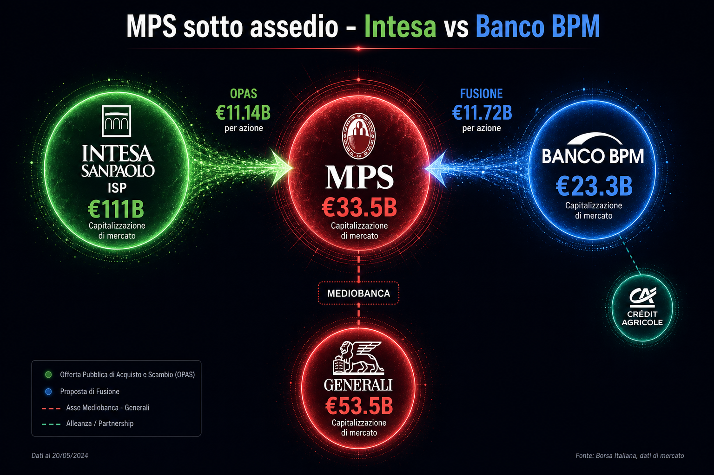
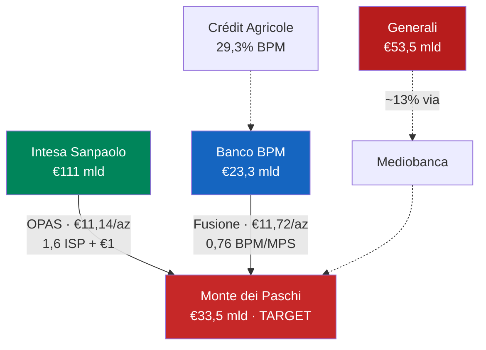
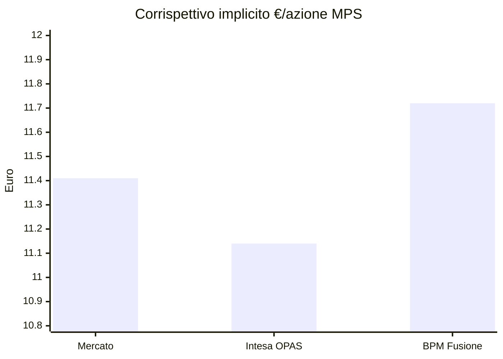
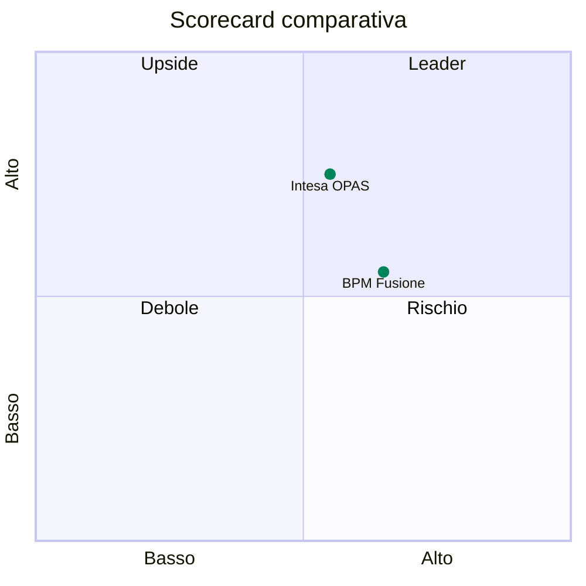

# MPS sotto assedio: Intesa vs Banco BPM

> **Come vedere questa pagina in Cursor:** apri questo file → tasto destro → **Open Preview** (oppure `Ctrl+Shift+V` / `Cmd+Shift+V`)

---

## Situazione (23 lug 2026)

| Operazione | Data | Struttura |
|---|---|---|
| **OPAS Intesa** | 8 giu 2026 | 1,6 azioni ISP + €1 cash per azione MPS |
| **Fusione BPM** | 7 giu 2026 | Merger of equals, concambio 0,75–0,77 BPM/MPS |

- CDA MPS: **bocciatura preliminare** OPAS Intesa
- Proposta BPM: **in valutazione**

---

## Mappa delle operazioni

---

## Corrispettivo per azione MPS

Prezzi al **15 lug 2026**: ISP €6,34 · MPS €11,41 · BPM €15,42

| Scenario | Valore | vs mercato |
|---|---:|---:|
| Prezzo di mercato | **€11,41** | — |
| OPAS Intesa | **€11,14** | **-2,4%** |
| Fusione BPM (0,76) | **€11,72** | **+2,7%** |

---

## Verdetto per azionista MPS

| | Intesa OPAS | BPM Fusione |
|---|---|---|
| **Corrispettivo** | €11,14 (-2,4%) | €11,72 (+2,7%) |
| **Brand MPS** | Perso (~635 filiali → Unipol) | Preservato |
| **Sinergie/anno** | €2,9 mld (2029) | €1,1 mld |
| **Generali** | A concorrente (Intesa vita) | Asset strategico nel gruppo |
| **Rischio** | Medio-alto (antitrust, DC) | Medio (assenso CA) |
| **Verdetto** | Neutro / leggermente negativo | **Preferibile se ≥0,76** |

---

## Scorecard (1–10) — azionisti MPS

| Dimensione | Intesa | BPM |
|---|:---:|:---:|
| Corrispettivo | 5 | **7** |
| Upside industriale | **8** | 5 |
| Preservazione identità | 4 | **9** |
| Rischio esecuzione | 7 | 6 |
| Governance | 5 | **7** |

---

## Generali (~13% via Mediobanca)

| Scenario Intesa | Scenario BPM |
|---|---|
| Controllo Generali + 3,01% diretto | Quota resta nel nuovo gruppo |
| Danish Compromise (+60–70 bp CET1) | CET1 pro-forma ~16% |
| Generali finisce a **concorrente** | Partner bancassicurazione: **Crédit Agricole** |
| Approvazione regolamentare incerta | Nessuno smembramento |

---

## Versione interattiva (browser in Cursor)

Se vuoi la versione **animata con canvas**:

1. `Ctrl+Shift+P` / `Cmd+Shift+P`
2. Cerca **Simple Browser: Show**
3. Incolla: `http://localhost:8765/mps-deal-comparison.html`

*(Il server locale parte automaticamente quando apri il workspace — vedi sotto)*

---

*Analisi a scopo informativo, non consulenza finanziaria.*
